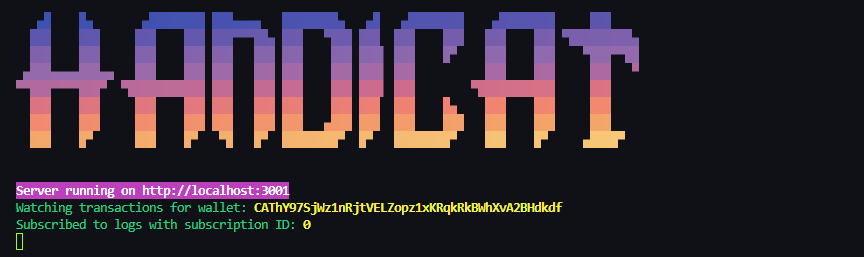

<!-- Improved compatibility of back to top link: See: https://github.com/othneildrew/Best-README-Template/pull/73 -->

<a id="readme-top"></a>

<!-- PROJECT LOGO -->
<br />
<div align="center">
  <a href="https://github.com/JedidiahBowlding/FoilOps">
    
  </a>

  <h3 align="center">FoilOps | Wallet Tracker</h3>

  <p align="center">
    Track any Solana transaction in Real-Time
  </p>
</div>

<!-- ABOUT THE PROJECT -->

## About The Project

[![Product Name Screen Shot][product-screenshot]](https://t.me/handi_cat_bot)

FoilOps is a Telegram bot that can track any Solana wallet in real time, it provides relevant information
of each transaction made in Raydium, Jupiter, Pump.fun and Pump AMM(PumpSwap) including transaction hash, tokens and amount swapped, price of the token in SOL, token market cap and much more.

The current stack also includes a smart-money execution layer with conservative canary controls, a Rust signal receiver, and mirrored web/Telegram trading posture summaries.

## Features

- 📈 Tracks in Real-Time any SOL transfer
- 🔍 Detects Raydium, Jupiter, Pump.fun and PumpSwap transactions
- 💰 Gets SOL price of the token swapped
- 📊 Gets token market cap at the time swapped
- 💰 Gets token amount and supply percentage owned by each tracked wallet
- 🤖 Each transaction message includes links to popular Solana trading bots to quickly buy the token
- 🔗 Each transaction provides links to Photon, GMGN and Dex Screener to quickly see the token chart
- 🚨 Flags known scam or rug-pull wallets using a curated scam-wallet database
- 🧭 Traces suspicious fund flows hop-by-hop across wallets, exchanges, bridges, custody wallets and mixer-like routes
- 🪙 Investigates a token contract to identify the likely developer wallet and related token history
- 📡 Monitors flagged developer wallets for future suspicious token launches and sends alerts
- 🖥️ Includes a scam-intelligence dashboard and JSON API for flagged wallets, trace history and token investigations
- 🧠 Emits SMART_MONEY_TRADE signals with portfolio confirmation and live canary posture tracking
- 🛡️ Applies live token market-risk gates for liquidity, concentration, honeypot and creator-control checks
- 📟 Mirrors trading posture and canary safety summaries in both the web dashboard and Telegram status commands

<p align="right">(<a href="#readme-top">back to top</a>)</p>

## Scam Intelligence

FoilOps now includes a scam-intelligence layer on top of normal wallet tracking.

- Known scam wallets are seeded from a curated list in `src/constants/known-scam-wallets.ts`
- Platform intelligence is loaded from repo-backed JSON files:
  - `src/constants/bridge-wallets.json`
  - `src/constants/custody-wallets.json`
  - `src/constants/exchange-wallets.json`
  - `src/constants/mixer-wallets.json`
- A flagged wallet can be traced automatically to show where funds move next
- Trace results can record platform interactions, flow-to-launch patterns, and token investigation history
- Token investigations can resolve a likely developer wallet from a token contract and start future monitoring on that wallet

Dashboard and API endpoints:

- `GET /dashboard/scam-wallets` renders the scam-intelligence dashboard
- `GET /api/scam-wallets` returns flagged wallets, launches, and flow-map data as JSON
- `GET /api/token-investigation/:tokenMint` runs a token investigation and returns developer/trace results as JSON

<p align="right">(<a href="#readme-top">back to top</a>)</p>

## Bot Commands

- `/start` – Opens the bot's main menu
- `/add` – Add a new wallet address
- `/delete` – Delete a wallet addresss
- `/upgrade` – Access the subscription menu
- `/ban_wallet` – Flag a wallet as BANNED and remove it from the wallet pool **(admin only)**
- `/flag_wallet <wallet> [reason]` – Mark a wallet as suspicious and begin tracing/monitoring it **(admin only)**
- `/unflag_wallet <wallet> [reason]` – Remove a wallet from scam monitoring **(admin only)**
- `/scam_feed [limit]` – Show recent suspicious launch and trace alerts **(admin only)**
- `/flow_map <wallet>` – Show the latest hop-by-hop flow map for a suspicious wallet **(admin only)**
- `/trace_token <token_contract_address>` – Investigate a token, resolve its likely developer wallet, trace funds, and enable future developer monitoring **(admin only)**
- `/help_notify` – Learn how bot notifications work
- `/help_group` – Instructions for adding the bot to group chats

<p align="right">(<a href="#readme-top">back to top</a>)</p>

## Built With

- 🌐 Node.JS
- 📘 TypeScript
- 📊 Prisma ORM
- 🪙 Solana Web3.js

<p align="right">(<a href="#readme-top">back to top</a>)</p>

<!-- GETTING STARTED -->

## Getting Started

Follow these simple steps to setup FoilOps locally on your machine

### Prerequisites

**Node version 14.x**

### Steps

1. Clone the repo

   ```sh
   git clone https://github.com/JedidiahBowlding/FoilOps.git
   ```

2. Install NPM packages

   ```sh
   pnpm install
   ```

3. Rename `.env.example` file to `.env`

4. Create a Postgres database and paste the connection string into `DATABASE_URL` in .env

5. Create a new `Telegram Bot` using `Bot Father` and get your `BOT_TOKEN`. Paste it into the corresponding variable in `.env`

6. Run the migration command to push the database schemas and generate all types

```sh
  pnpm db:migrate
```

Recent schema additions include scam-wallet intelligence, trace events, and token investigation event types.

7. `(Optional)` To use a webhook connection instead of polling, set your .env like this:

```env
ENVIRONMENT=production
APP_URL=https://your-domain.com

# APP_URL must be the public HTTPS URL where your bot is deployed.
# The bot will automatically register its webhook at `APP_URL/webhook/telegram.
```

8. `(Optional)` Set up custom RPC providers by adding them to the RPC_ENDPOINTS environment variable.
   You can list multiple endpoints separated by commas, e.g.:

```env
RPC_ENDPOINTS=https://rpc1.com,https://rpc2.com
```

`(Optional)` Add or maintain local platform intelligence by editing these repo files:

```text
src/constants/bridge-wallets.json
src/constants/custody-wallets.json
src/constants/exchange-wallets.json
src/constants/mixer-wallets.json
```

Each JSON file uses this shape:

```json
{
  "wallet_or_program_address": {
    "label": "Human readable name",
    "category": "BRIDGE"
  }
}
```

### Encrypted Backup Mode (Recommended for Sensitive Data)

Backups exclude `personalWalletPrivKey` by default.

- `INCLUDE_PRIVATE_KEYS_IN_BACKUP=true` is only allowed when `ENCRYPT_BACKUP=true`
- Encrypted backups are written to `database_backup.enc.json`
- Plain backups are written to `database_backup.json` and always exclude private keys

Set these environment variables when you need encrypted backups:

```env
INCLUDE_PRIVATE_KEYS_IN_BACKUP=true
ENCRYPT_BACKUP=true
BACKUP_ENCRYPTION_KEY=your_32_byte_base64_or_64_char_hex_key
```

Restore notes:

- `pnpm db:seed` auto-detects `database_backup.enc.json` first
- You can force a file path with `BACKUP_FILE`
- For encrypted backups, `BACKUP_ENCRYPTION_KEY` must be set during restore too

### Trade Signal Integration Env Vars

When using the TypeScript intelligence plane with the Rust execution receiver, configure these variables:

```env
# TypeScript emitter
TRADE_SIGNAL_ENDPOINT=http://127.0.0.1:8787/signals
TRADE_SIGNAL_TIMEOUT_MS=4000
TRADE_SIGNAL_REQUIRE_AUTH=true
TRADE_SIGNAL_AUTH_SECRET=shared_hmac_secret

# Rust receiver
SIGNAL_RECEIVER_BIND=127.0.0.1:8787
SIGNAL_RECEIVER_DRY_RUN=true
SIGNAL_REQUIRE_AUTH=true
SIGNAL_AUTH_SECRET=shared_hmac_secret
SIGNAL_DEDUP_WINDOW_SECONDS=300
SIGNAL_MAX_TIMESTAMP_SKEW_SECONDS=120
```

`TRADE_SIGNAL_AUTH_SECRET` and `SIGNAL_AUTH_SECRET` must match.

### Whale Auto-Tracking (Credit Safe Defaults)

Auto whale discovery is now opt-in to prevent accidental RPC credit drain.

```env
# Recommended: keep auto discovery off unless you are actively tuning it
WHALE_AUTO_TRACK_ENABLED=false

# Preferred: provide curated human-like whales manually (comma-separated)
WHALE_MANUAL_WALLETS=wallet1,wallet2,wallet3

# Optional exclusions if you detect bot wallets
WHALE_EXCLUDE_WALLETS=botWallet1,botWallet2

# Only used when WHALE_AUTO_TRACK_ENABLED=true
WHALE_MIN_BALANCE_USD=1000000
WHALE_TOP_ACTIVE_WALLETS=5
WHALE_ACTIVITY_SIGNATURE_LIMIT=120
WHALE_MIN_ACTIVITY_HITS=2
WHALE_MAX_ACTIVITY_HITS=10
WHALE_MAX_BALANCE_CHECKS=40
```

Notes:

- `WHALE_MANUAL_WALLETS` takes priority over auto-discovery.
- `WHALE_MAX_ACTIVITY_HITS` filters out hyper-active wallets that are often bot-driven.

### Receiver Health + Auth/Dedupe Self-Test

The receiver exposes a health endpoint:

- `GET /health` returns mode, auth requirement, and dedupe/timestamp windows.

CI/local validation script:

```sh
pnpm signals:self-test
```

The script validates:

- Health endpoint is reachable.
- Unsigned request is rejected when auth is required.
- Signed request is accepted.
- Replayed duplicate request is rejected with HTTP 409.

### Smart-Money Canary Controls

When you enable the live trading receiver, keep the following posture aligned across the TypeScript app and Rust bot:

```env
TRADE_SIGNAL_ENDPOINT=http://127.0.0.1:8787/signals
TRADE_SIGNAL_AUTH_SECRET=shared_hmac_secret
SIGNAL_RECEIVER_BIND=127.0.0.1:8787
SIGNAL_RECEIVER_DRY_RUN=false
SIGNAL_REQUIRE_AUTH=true
SIGNAL_AUTH_SECRET=shared_hmac_secret
SIGNAL_DEDUP_WINDOW_SECONDS=300
SIGNAL_MAX_TIMESTAMP_SKEW_SECONDS=120
```

For a conservative canary, use the dashboard or Telegram controls to keep buy size small, max concurrent trades at 1, and liquidity / alert-quality gates tight.

Example CI sequence:

```sh
cd Auto-solana-trading-bot
SIGNAL_RECEIVER_BIND=127.0.0.1:8787 \
SIGNAL_RECEIVER_DRY_RUN=true \
SIGNAL_REQUIRE_AUTH=true \
SIGNAL_AUTH_SECRET=test-secret \
cargo +stable run --bin signal-receiver &

cd ..
SIGNAL_TEST_BASE_URL=http://127.0.0.1:8787 \
SIGNAL_TEST_AUTH_SECRET=test-secret \
pnpm signals:self-test
```

9. Start the combined stack

```sh
./start-both.sh
# or
pnpm start-both
```

### Starting Both Services

To start both the FoilOps bot and the Auto Solana Trading Bot simultaneously on a server or local machine:

```sh
# Option 1: Using the convenience script
./start-both.sh

# Option 2: Using pnpm
pnpm start-both
```

This will start:

- 🤖 **FoilOps Wallet Tracker** (TypeScript/Node.js bot)
- 📈 **Auto Solana Trading Bot** (Rust trading bot with copy trading)

Both services will run in the background and the startup script will verify health automatically.

If the stack is managed by PM2 on the server, restart it with:

```sh
pm2 restart ecosystem.config.js --update-env
```

After any restart, run the health check:

```sh
bash scripts/start-both-health-check.sh
```

**Note**: Make sure you have configured both bots' environment variables before starting.

10. That's it! your local or server deployment is ready to use.

<p align="center"></>

<p align="right">(<a href="#readme-top">back to top</a>)</p>

<!-- CONTACT -->

## Contact

<!-- [@your_twitter](https://twitter.com/your_username)  --> - rdraco039@gmail.com

My solana wallet for the struggles - `5EVQsbVErvJruJvi3v8i3sDSy58GUnGfewwRb8pJk8N1`

Project Link: [https://github.com/JedidiahBowlding/FoilOps](https://github.com/JedidiahBowlding/FoilOps)

<p align="right">(<a href="#readme-top">back to top</a>)</p>

<!-- MARKDOWN LINKS & IMAGES -->
<!-- https://www.markdownguide.org/basic-syntax/#reference-style-links -->

[contributors-shield]: https://img.shields.io/github/contributors/othneildrew/Best-README-Template.svg?style=for-the-badge
[contributors-url]: https://github.com/othneildrew/Best-README-Template/graphs/contributors
[forks-shield]: https://img.shields.io/github/forks/othneildrew/Best-README-Template.svg?style=for-the-badge
[forks-url]: https://github.com/othneildrew/Best-README-Template/network/members
[stars-shield]: https://img.shields.io/github/stars/othneildrew/Best-README-Template.svg?style=for-the-badge
[stars-url]: https://github.com/othneildrew/Best-README-Template/stargazers
[issues-shield]: https://img.shields.io/github/issues/othneildrew/Best-README-Template.svg?style=for-the-badge
[issues-url]: https://github.com/othneildrew/Best-README-Template/issues
[license-shield]: https://img.shields.io/github/license/othneildrew/Best-README-Template.svg?style=for-the-badge
[license-url]: https://github.com/othneildrew/Best-README-Template/blob/master/LICENSE.txt
[linkedin-shield]: https://img.shields.io/badge/-LinkedIn-black.svg?style=for-the-badge&logo=linkedin&colorB=555
[linkedin-url]: https://linkedin.com/in/othneildrew
[telegram-bot]: https://img.shields.io/badge/Telegram-2CA5E0?style=for-the-badge&logo=telegram&logoColor=white
[product-screenshot]: showcase/notifications-new.png
